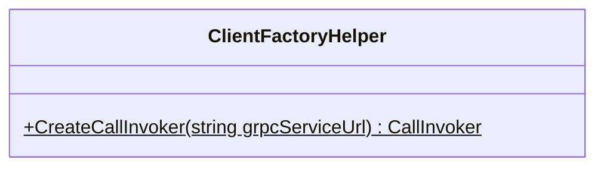
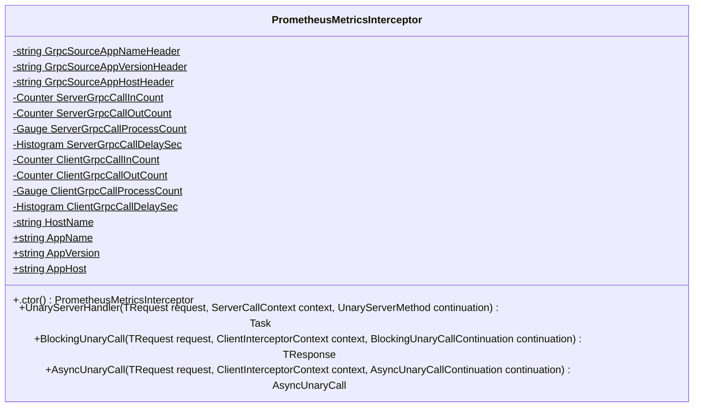

<!-- markdownlint-capture -->
<!-- markdownlint-disable -->

# Code Metrics

This file is dynamically maintained by a bot, *please do not* edit this by hand. It represents various [code metrics](https://aka.ms/dotnet/code-metrics), such as cyclomatic complexity, maintainability index, and so on.

## MyJetWallet.Sdk.GrpcMetrics :exploding_head:

The *MyJetWallet.Sdk.GrpcMetrics.csproj* project file contains:

- 1 namespaces.
- 2 named types.
- 227 total lines of source code.
- Approximately 72 lines of executable code.
- The highest cyclomatic complexity is 17 :exploding_head:.

  <strong id="myjetwallet-sdk-grpcmetrics">
    MyJetWallet.Sdk.GrpcMetrics :exploding_head:
  </strong>

 

The `MyJetWallet.Sdk.GrpcMetrics` namespace contains 2 named types.

- 2 named types.
- 227 total lines of source code.
- Approximately 72 lines of executable code.
- The highest cyclomatic complexity is 17 :exploding_head:.

  <strong id="clientfactoryhelper">
    ClientFactoryHelper :heavy_check_mark:
  </strong>

 

- The `ClientFactoryHelper` contains 1 members.
- 15 total lines of source code.
- Approximately 6 lines of executable code.
- The highest cyclomatic complexity is 1 :heavy_check_mark:.

| Member kind | Line number | Maintainability index | Cyclomatic complexity | Depth of inheritance | Class coupling | Lines of source / executable code |
| :-: | :-: | :-: | :-: | :-: | :-: | :-: |
| Method | <a href='https://github.com/MyJetWallet/MyJetWallet.Sdk.GrpcMetrics/blob/master/src/MyJetWallet.Sdk.GrpcMetrics/ClientFactoryHelper.cs#L11' title='CallInvoker ClientFactoryHelper.CreateCallInvoker(string grpcServiceUrl)'>11</a> | 72 | 1 :heavy_check_mark: | 0 | 5 | 12 / 6 |

<a href="#ClientFactoryHelper-class-diagram">:link: to `ClientFactoryHelper` class diagram</a>

<a href="#myjetwallet-sdk-grpcmetrics">:top: back to MyJetWallet.Sdk.GrpcMetrics</a>

  <strong id="prometheusmetricsinterceptor">
    PrometheusMetricsInterceptor :exploding_head:
  </strong>

 

- The `PrometheusMetricsInterceptor` contains 19 members.
- 207 total lines of source code.
- Approximately 66 lines of executable code.
- The highest cyclomatic complexity is 17 :exploding_head:.

| Member kind | Line number | Maintainability index | Cyclomatic complexity | Depth of inheritance | Class coupling | Lines of source / executable code |
| :-: | :-: | :-: | :-: | :-: | :-: | :-: |
| Method | <a href='https://github.com/MyJetWallet/MyJetWallet.Sdk.GrpcMetrics/blob/master/src/MyJetWallet.Sdk.GrpcMetrics/PrometheusMetricsInterceptor.cs#L75' title='PrometheusMetricsInterceptor.PrometheusMetricsInterceptor()'>75</a> | 70 | 8 :warning: | 0 | 1 | 13 / 5 |
| Property | <a href='https://github.com/MyJetWallet/MyJetWallet.Sdk.GrpcMetrics/blob/master/src/MyJetWallet.Sdk.GrpcMetrics/PrometheusMetricsInterceptor.cs#L18' title='string PrometheusMetricsInterceptor.AppHost'>18</a> | 100 | 2 :heavy_check_mark: | 0 | 0 | 1 / 0 |
| Property | <a href='https://github.com/MyJetWallet/MyJetWallet.Sdk.GrpcMetrics/blob/master/src/MyJetWallet.Sdk.GrpcMetrics/PrometheusMetricsInterceptor.cs#L16' title='string PrometheusMetricsInterceptor.AppName'>16</a> | 100 | 2 :heavy_check_mark: | 0 | 0 | 1 / 0 |
| Property | <a href='https://github.com/MyJetWallet/MyJetWallet.Sdk.GrpcMetrics/blob/master/src/MyJetWallet.Sdk.GrpcMetrics/PrometheusMetricsInterceptor.cs#L17' title='string PrometheusMetricsInterceptor.AppVersion'>17</a> | 100 | 2 :heavy_check_mark: | 0 | 0 | 1 / 0 |
| Method | <a href='https://github.com/MyJetWallet/MyJetWallet.Sdk.GrpcMetrics/blob/master/src/MyJetWallet.Sdk.GrpcMetrics/PrometheusMetricsInterceptor.cs#L167' title='AsyncUnaryCall<TResponse> PrometheusMetricsInterceptor.AsyncUnaryCall<TRequest, TResponse>(TRequest request, ClientInterceptorContext<TRequest, TResponse> context, AsyncUnaryCallContinuation<TRequest, TResponse> continuation)'>167</a> | 51 | 7 :heavy_check_mark: | 0 | 8 | 53 / 23 |
| Method | <a href='https://github.com/MyJetWallet/MyJetWallet.Sdk.GrpcMetrics/blob/master/src/MyJetWallet.Sdk.GrpcMetrics/PrometheusMetricsInterceptor.cs#L131' title='TResponse PrometheusMetricsInterceptor.BlockingUnaryCall<TRequest, TResponse>(TRequest request, ClientInterceptorContext<TRequest, TResponse> context, BlockingUnaryCallContinuation<TRequest, TResponse> continuation)'>131</a> | 56 | 7 :heavy_check_mark: | 0 | 7 | 35 / 15 |
| Field | <a href='https://github.com/MyJetWallet/MyJetWallet.Sdk.GrpcMetrics/blob/master/src/MyJetWallet.Sdk.GrpcMetrics/PrometheusMetricsInterceptor.cs#L64' title='Histogram PrometheusMetricsInterceptor.ClientGrpcCallDelaySec'>64</a> | 84 | 0 :heavy_check_mark: | 0 | 3 | 7 / 1 |
| Field | <a href='https://github.com/MyJetWallet/MyJetWallet.Sdk.GrpcMetrics/blob/master/src/MyJetWallet.Sdk.GrpcMetrics/PrometheusMetricsInterceptor.cs#L49' title='Counter PrometheusMetricsInterceptor.ClientGrpcCallInCount'>49</a> | 85 | 0 :heavy_check_mark: | 0 | 3 | 3 / 1 |
| Field | <a href='https://github.com/MyJetWallet/MyJetWallet.Sdk.GrpcMetrics/blob/master/src/MyJetWallet.Sdk.GrpcMetrics/PrometheusMetricsInterceptor.cs#L54' title='Counter PrometheusMetricsInterceptor.ClientGrpcCallOutCount'>54</a> | 84 | 0 :heavy_check_mark: | 0 | 3 | 3 / 1 |
| Field | <a href='https://github.com/MyJetWallet/MyJetWallet.Sdk.GrpcMetrics/blob/master/src/MyJetWallet.Sdk.GrpcMetrics/PrometheusMetricsInterceptor.cs#L59' title='Gauge PrometheusMetricsInterceptor.ClientGrpcCallProcessCount'>59</a> | 85 | 0 :heavy_check_mark: | 0 | 3 | 3 / 1 |
| Field | <a href='https://github.com/MyJetWallet/MyJetWallet.Sdk.GrpcMetrics/blob/master/src/MyJetWallet.Sdk.GrpcMetrics/PrometheusMetricsInterceptor.cs#L22' title='string PrometheusMetricsInterceptor.GrpcSourceAppHostHeader'>22</a> | 93 | 0 :heavy_check_mark: | 0 | 0 | 1 / 1 |
| Field | <a href='https://github.com/MyJetWallet/MyJetWallet.Sdk.GrpcMetrics/blob/master/src/MyJetWallet.Sdk.GrpcMetrics/PrometheusMetricsInterceptor.cs#L20' title='string PrometheusMetricsInterceptor.GrpcSourceAppNameHeader'>20</a> | 93 | 0 :heavy_check_mark: | 0 | 0 | 1 / 1 |
| Field | <a href='https://github.com/MyJetWallet/MyJetWallet.Sdk.GrpcMetrics/blob/master/src/MyJetWallet.Sdk.GrpcMetrics/PrometheusMetricsInterceptor.cs#L21' title='string PrometheusMetricsInterceptor.GrpcSourceAppVersionHeader'>21</a> | 93 | 0 :heavy_check_mark: | 0 | 0 | 1 / 1 |
| Field | <a href='https://github.com/MyJetWallet/MyJetWallet.Sdk.GrpcMetrics/blob/master/src/MyJetWallet.Sdk.GrpcMetrics/PrometheusMetricsInterceptor.cs#L73' title='string PrometheusMetricsInterceptor.HostName'>73</a> | 100 | 0 :heavy_check_mark: | 0 | 0 | 1 / 0 |
| Field | <a href='https://github.com/MyJetWallet/MyJetWallet.Sdk.GrpcMetrics/blob/master/src/MyJetWallet.Sdk.GrpcMetrics/PrometheusMetricsInterceptor.cs#L39' title='Histogram PrometheusMetricsInterceptor.ServerGrpcCallDelaySec'>39</a> | 84 | 0 :heavy_check_mark: | 0 | 3 | 7 / 1 |
| Field | <a href='https://github.com/MyJetWallet/MyJetWallet.Sdk.GrpcMetrics/blob/master/src/MyJetWallet.Sdk.GrpcMetrics/PrometheusMetricsInterceptor.cs#L24' title='Counter PrometheusMetricsInterceptor.ServerGrpcCallInCount'>24</a> | 85 | 0 :heavy_check_mark: | 0 | 3 | 3 / 1 |
| Field | <a href='https://github.com/MyJetWallet/MyJetWallet.Sdk.GrpcMetrics/blob/master/src/MyJetWallet.Sdk.GrpcMetrics/PrometheusMetricsInterceptor.cs#L29' title='Counter PrometheusMetricsInterceptor.ServerGrpcCallOutCount'>29</a> | 84 | 0 :heavy_check_mark: | 0 | 3 | 3 / 1 |
| Field | <a href='https://github.com/MyJetWallet/MyJetWallet.Sdk.GrpcMetrics/blob/master/src/MyJetWallet.Sdk.GrpcMetrics/PrometheusMetricsInterceptor.cs#L34' title='Gauge PrometheusMetricsInterceptor.ServerGrpcCallProcessCount'>34</a> | 85 | 0 :heavy_check_mark: | 0 | 3 | 3 / 1 |
| Method | <a href='https://github.com/MyJetWallet/MyJetWallet.Sdk.GrpcMetrics/blob/master/src/MyJetWallet.Sdk.GrpcMetrics/PrometheusMetricsInterceptor.cs#L89' title='Task<TResponse> PrometheusMetricsInterceptor.UnaryServerHandler<TRequest, TResponse>(TRequest request, ServerCallContext context, UnaryServerMethod<TRequest, TResponse> continuation)'>89</a> | 51 | 17 :exploding_head: | 0 | 8 | 41 / 19 |

<a href="#PrometheusMetricsInterceptor-class-diagram">:link: to `PrometheusMetricsInterceptor` class diagram</a>

<a href="#myjetwallet-sdk-grpcmetrics">:top: back to MyJetWallet.Sdk.GrpcMetrics</a>

<a href="#myjetwallet-sdk-grpcmetrics">:top: back to MyJetWallet.Sdk.GrpcMetrics</a>

## Metric definitions

  - **Maintainability index**: Measures ease of code maintenance. Higher values are better.
  - **Cyclomatic complexity**: Measures the number of branches. Lower values are better.
  - **Depth of inheritance**: Measures length of object inheritance hierarchy. Lower values are better.
  - **Class coupling**: Measures the number of classes that are referenced. Lower values are better.
  - **Lines of source code**: Exact number of lines of source code. Lower values are better.
  - **Lines of executable code**: Approximates the lines of executable code. Lower values are better.

## Mermaid class diagrams

##### `ClientFactoryHelper` class diagram

##### `PrometheusMetricsInterceptor` class diagram

*This file is maintained by a bot.*

<!-- markdownlint-restore -->
